# Meridian Supply Chain RAG Assistant

A Retrieval-Augmented Generation assistant that lets a buyer ask plain-English
questions and get answers drawn from Meridian Components' Q1 FY2025-26 Supply
Chain Review and its Procurement Policy Handbook v4.2 — with the source
document and page shown under every answer.

Uses the **Gemini API** for both embeddings and answering, with OpenAI
available as an optional fallback if a key is configured.

## Demo Video
[▶️ Watch demo.webm](video/demo.webm) — recorded in the repo (upload, indexing,
cross-document questions, and the trap question being refused).

## Architecture

```
PDF -> pdfplumber (per-page text extraction)
     -> recursive character chunking (1100 chars, 150 char overlap)
     -> Gemini embedding (gemini-embedding-001, 768-dim), batched
     -> ChromaDB (persisted to ./chroma_db, deterministic chunk ids so
        re-indexing upserts instead of duplicating)
     -> [on a question] embed question -> Chroma similarity search
        (top_k, default 8, adjustable via a slider in the UI)
     -> Gemini generation, tried across a short model fallback list (see
        GEMINI_CHAT_MODELS in llm_providers.py)
     -> Streamlit UI displays the answer and the source file/page for
        every chunk that was retrieved
```

Orchestration uses the plain `google-genai` SDK directly (no LangChain/
LangGraph for the RAG logic itself — `langchain-text-splitters` is used
only for the chunking step), kept deliberately simple per the assignment's
"keep it simple" guidance.

### Why a model fallback chain, and how it works

Gemini has been retiring model IDs faster than their published shutdown
dates, so `llm_providers.py` doesn't hardcode a single model name for
answering. `ask_llm()`:

1. Tries each model in `GEMINI_CHAT_MODELS` in order — currently
   `gemini-3.6-flash`, then `gemini-3.5-flash-lite` — moving to the next
   one if a call raises any exception (including a rate-limit or a
   retired-model error).
2. Falls back to OpenAI's `gpt-4o` if `OPENAI_API_KEY` is set and every
   Gemini attempt failed.
3. Raises with the collected error from every attempt only if all
   configured providers fail.

This is a straightforward try-next-on-failure chain, not a retry-with-
backoff loop — a transient error on a given model moves straight to the
next model rather than retrying the same one. That's a reasonable
trade-off for a project this size, but it does mean a single flaky
response can burn through the whole list faster than it needs to; adding
one retry with a short backoff before falling through would be a natural
next improvement.

Embeddings only have one current Gemini text-embedding model
(`gemini-embedding-001`), so there's no fallback model on that side; the
768-dimension output (Matryoshka-truncated from the 3072-dim default)
keeps the Chroma index small with negligible quality loss for chunks this
short.

## Setup

1. Clone the repo and `cd` into it.
2. Create a virtual environment and install dependencies:
   ```bash
   python3 -m venv .venv
   source .venv/bin/activate      # Windows: .venv\Scripts\activate
   pip install -r requirements.txt
   ```
3. Copy `.env.example` to `.env` and add your Gemini API key (free at
   https://aistudio.google.com/apikey):
   ```bash
   cp .env.example .env
   # edit .env: GEMINI_API_KEY=AIza...
   ```
   An `OPENAI_API_KEY` can also be added as a fallback for answering only
   (not embeddings) — leave it blank if you don't have one.
4. Run the app:
   ```bash
   streamlit run app.py
   ```
5. In the sidebar, upload the two PDFs from `data/` (or your own), click
   **Index documents**, then ask a question in the main panel.

Indexed data persists in `./chroma_db` — closing and reopening the app does
not require re-uploading, as long as `chroma_db/` still exists on disk.

### Optional: FastAPI backend

```bash
uvicorn api.main:app --reload
```
Then open `http://localhost:8000/docs` to try `/ingest`, `/ask`, and
`/stats` directly. Live responses from this project's own run are in
`screenshots/fastapi/` (`HOME.png`, `INGEST.png`, `ASK-1.png`, `ASK-2.png`,
`STATS.png`) and logged in `screenshots/FASTAPI.txt`.

## Chunking choice

**Chunk size 1100 characters, 150 character overlap.** Both PDFs are
table-heavy — supplier scorecards, freight lane tables, approval-authority
tables — and a chunk near the top of the assignment's 800–1200 range keeps
a full table row, or a row plus its header, together rather than splitting
a number away from the label that explains it. The 150-char overlap
ensures a sentence sitting on a chunk boundary is still whole in at least
one chunk.

Actual result on the two provided PDFs, verified by running the
load/chunk step standalone: **24 chunks total — 11 from the Supply Chain
Review, 13 from the Procurement Policy Handbook** (confirmed by
`screenshots/FASTAPI.txt`, which shows `"total_chunks": 24` from a live
`/ingest` call).


# Landing Page UI


## Test questions and answers
All ten answers below were generated by the running app against the
indexed PDFs (full text also saved in `screenshots/answers.txt`), with a
screenshot from the actual run for each one.

1. **Which supplier had the highest spend in Q1, and what was its on-time delivery percentage?**
   Shenzhen Rui Electronics had the highest Q1 spend, at ₹21.9 crore, with an on-time delivery rate of 79.5%.
   *(Source: Meridian_Supply_Chain_Review_Q1_FY2025-26.pdf, pages 1–3)*
   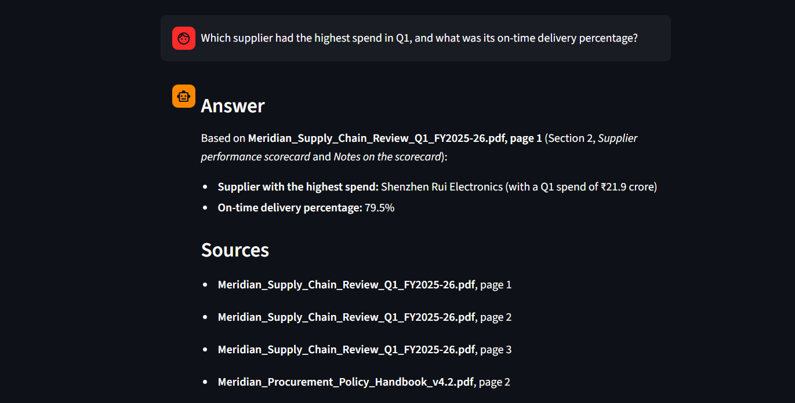

2. **How many line stoppages happened in Q1, what was the total downtime, and what caused them?**
   7 line-stoppage events across two plants, 41 hours of total downtime. Causes: a microcontroller shortage from Shenzhen Rui Electronics (4 events, 22 hrs — a vessel roll-over, a 9-day customs hold, a partial shipment, and an allocation shortfall), PCB quality rejections from Trident Circuit Boards (2 events, 11 hrs), and a transporter strike on the Coimbatore–Pune corridor (1 event, 5 hrs).
   *(Sources: Meridian_Supply_Chain_Review_Q1_FY2025-26.pdf, pages 1–3)*
   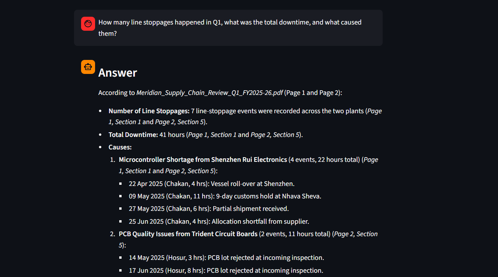
   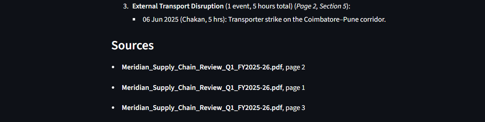

3. **What is the approval authority for a purchase order worth ₹1.4 crore?**
   Per Section 3 of the handbook, an order above ₹1 crore and up to ₹5 crore requires Chief Operating Officer approval — so ₹1.4 crore needs COO sign-off.
   *(Source: Meridian_Procurement_Policy_Handbook_v4.2.pdf, pages 1–3)*
   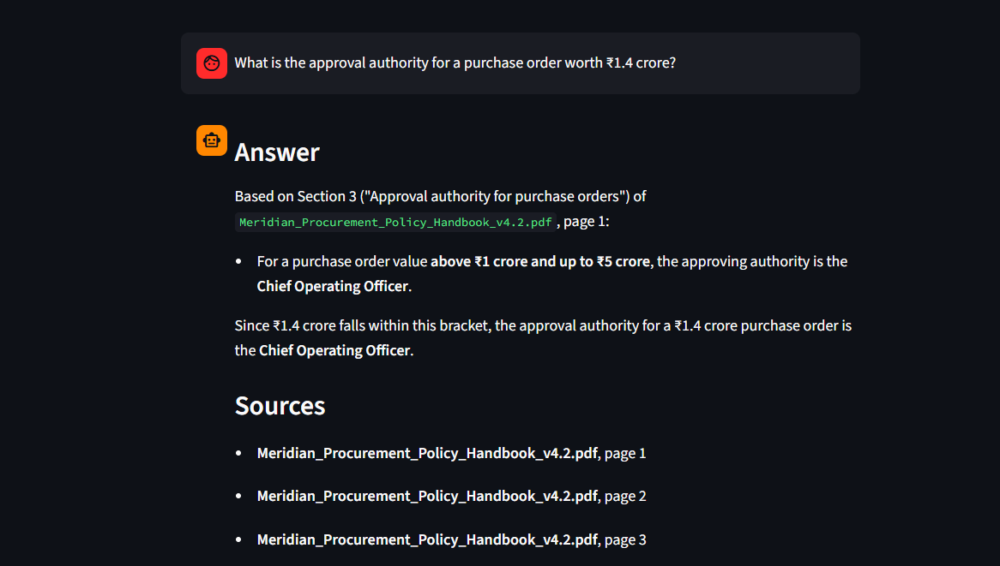

4. **What are the four supplier classification categories, and what qualifies a supplier as Critical?**
   The four categories are Critical, Strategic, Standard, and Tail. A supplier qualifies as Critical if it meets any one of: single-source for any part, annual spend above ₹10 crore, or supplies a safety-related component.
   *(Sources: Meridian_Procurement_Policy_Handbook_v4.2.pdf, pages 1–2; Meridian_Supply_Chain_Review_Q1_FY2025-26.pdf, page 1)*
   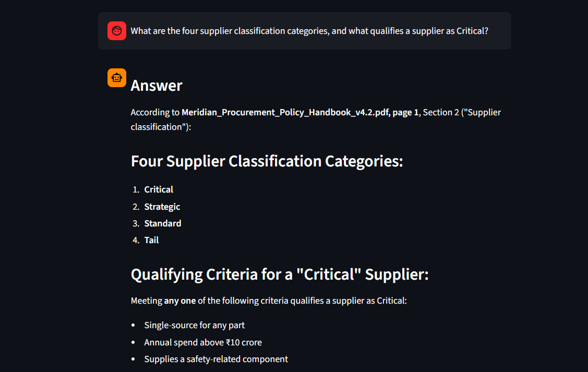
   

5. **Kaveri Metals recorded 88.1% on-time delivery and 1,150 defects per million in Q1. Which policy clauses does this trigger, and what exactly must the buyer do?**
   Triggers Clause 6.1 (on-time delivery below 90%) and Clause 6.3 (defect rate above 500 PPM). Under 6.1: issue a written warning within 10 working days of quarter close and move the supplier to weekly delivery review calls until it recovers above 90% for a full quarter. Under 6.3: recover rework cost at ₹120 per affected unit and impose 100% incoming inspection at the supplier's cost until three consecutive clean lots.
   *(Sources: Meridian_Procurement_Policy_Handbook_v4.2.pdf, page 2; Meridian_Supply_Chain_Review_Q1_FY2025-26.pdf, pages 1–3)*
   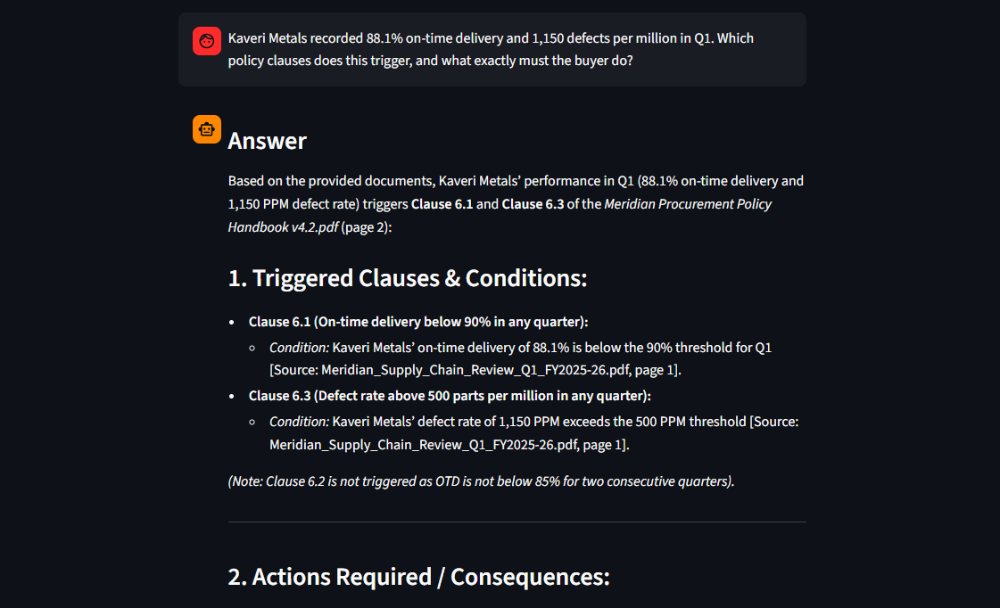
   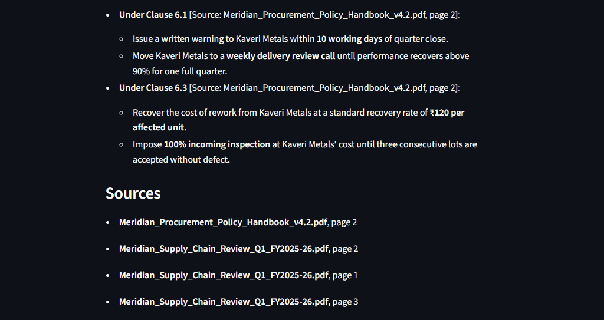

6. **The microcontroller supplier is single-source. What does the sourcing policy require in this situation, and what is the company already doing about it?**
   Being single-source makes Shenzhen Rui Electronics a Critical supplier (Section 2). Section 7.1 requires a qualified second source within 12 months of that classification, with monthly progress reported to the Management Committee; Section 7.2 caps any single supplier at 60% of a part's volume once dual-sourced, absent written COO approval. The company is already qualifying an alternate supplier.
   *(Sources: Meridian_Procurement_Policy_Handbook_v4.2.pdf, pages 1–3; Meridian_Supply_Chain_Review_Q1_FY2025-26.pdf, page 1)*
   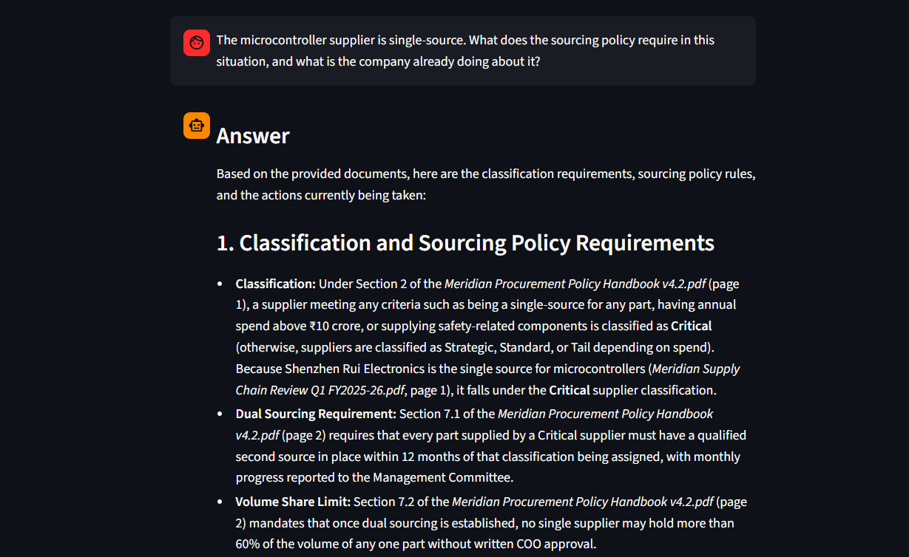
   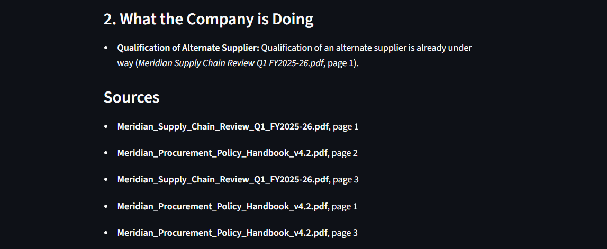

7. **Microcontrollers are imported with a 46-day lead time. Using the safety-stock policy, how many days of stock should be held for this part?**
   Base formula: 46 × 0.25 = 11.5 days. The minimum floor for an imported, Critical-supplier part is 30 days, which is higher than the calculated value — and the microcontroller supplier is Critical (single-source, currently undergoing dual-sourcing). So 30 days of stock should be held.
   *(Sources: Meridian_Procurement_Policy_Handbook_v4.2.pdf, pages 2–3; Meridian_Supply_Chain_Review_Q1_FY2025-26.pdf, pages 1–3)*
   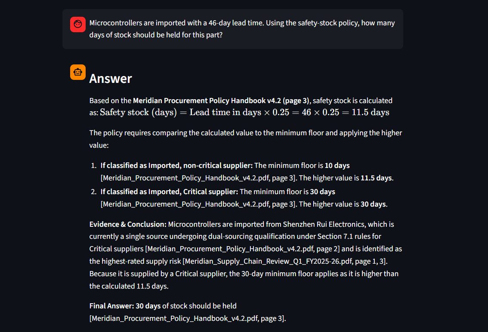
   

8. **Trident Circuit Boards had a defect rate of 640 parts per million. What is the cost consequence under the policy?**
   640 PPM exceeds the 500 PPM threshold, triggering Clause 6.3: the supplier bears rework cost at ₹120 per affected unit, and 100% incoming inspection is imposed at the supplier's cost until three consecutive lots are accepted defect-free.
   *(Sources: Meridian_Procurement_Policy_Handbook_v4.2.pdf, pages 2–3; Meridian_Supply_Chain_Review_Q1_FY2025-26.pdf, pages 1–2)*
   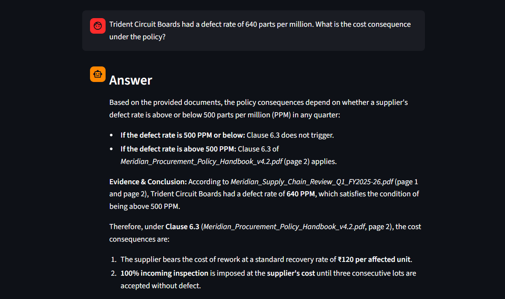
   

9. **Which suppliers would fall below the B rating band on on-time delivery alone, and what is the escalation path for them?**
   No supplier fell below Band B (below 75%) — the lowest was Shenzhen Rui Electronics at 79.5%. Three suppliers fell below Band A (below 90%): Shenzhen Rui Electronics (79.5%), Trident Circuit Boards (84.6%), and Kaveri Metals (88.1%), all triggering Clause 6.1. Shenzhen Rui Electronics additionally triggers Clause 6.2 (below 85% for two consecutive quarters: 83.2% in Q4 FY24-25, 79.5% in Q1 FY25-26) — a 2% debit note on quarterly invoice value plus a formal improvement plan within 15 working days, escalating to a business hold (Clause 6.4) if not submitted. The general escalation matrix (Section 10) runs Buyer (Level 1, ≤3-day slippage) → Category Manager (Level 2, >3-day slippage or a rejected lot) → Head of Procurement (Level 3, line-stoppage risk within 7 days) → COO (Level 4, actual stoppage or supplier insolvency signal).
   *(Sources: Meridian_Procurement_Policy_Handbook_v4.2.pdf, pages 2–3; Meridian_Supply_Chain_Review_Q1_FY2025-26.pdf, pages 1, 3)*
   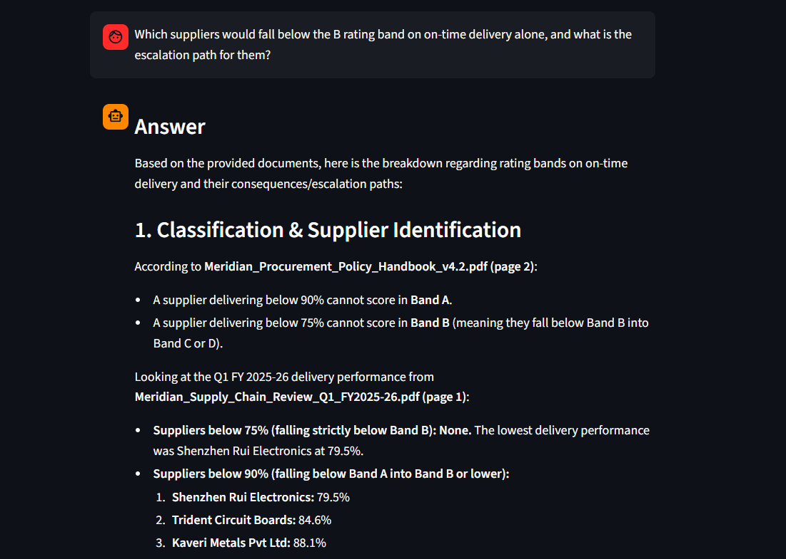
   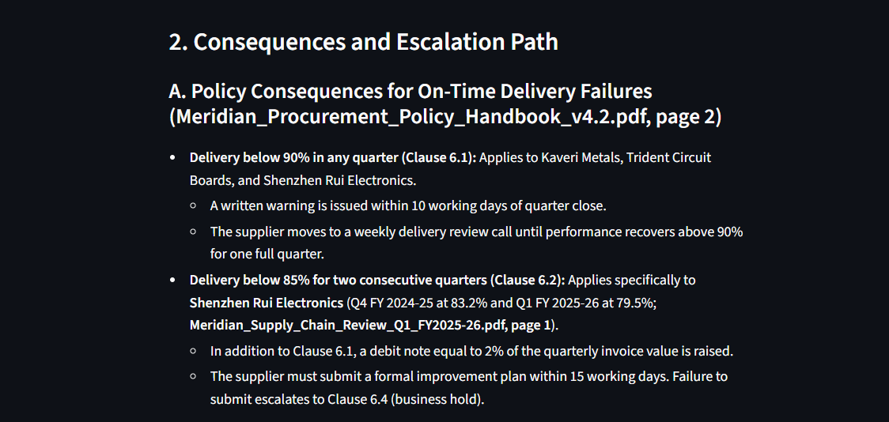
   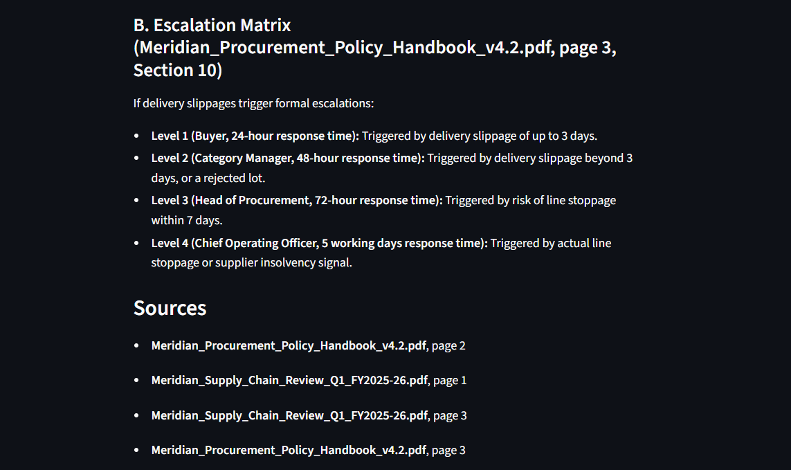

10. **Trap question — "What is the annual salary of the Head of Procurement?"**
    The information is not available in the uploaded documents — correctly refused rather than answered with an invented number.
    *(Sources: Meridian_Procurement_Policy_Handbook_v4.2.pdf, pages 1, 3; Meridian_Supply_Chain_Review_Q1_FY2025-26.pdf, page 1)*
    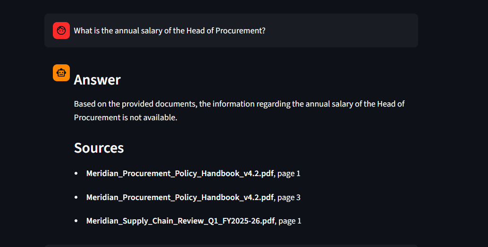


## Known limitations / honest notes

- **All ten test questions were answered correctly** in this run, including
  both trap-style checks: Q9 correctly reported that *no* supplier fell
  below Band B rather than forcing a match, and Q10's salary question was
  correctly refused instead of guessed.
- **`top_k` matters more on the cross-document questions (5–9).** These
  need a number from the review *and* a clause from the handbook to land
  in the same context window; the code comment in `rag.py` calls out that
  `top_k` around 5–6 or higher is needed rather than 3–4, which is why the
  default was set to 8 and left adjustable via a slider in the UI rather
  than hardcoded. This run used the default of 8 throughout; the effect of
  lower values on these specific questions wasn't separately re-tested and
  logged for this README.
- **No retry-with-backoff on the answering call.** As noted in the
  Architecture section, `ask_llm()` moves to the next model in the list on
  any failure rather than retrying the same model with backoff first. On
  Gemini's free tier this means a single rate-limit hit skips straight to
  the next model instead of waiting it out, which is fine for this
  project's scale but wouldn't be efficient at higher volume.
- **The UI doesn't currently surface which model produced a given answer.**
  `ask_llm()` returns only the text, not which entry in `GEMINI_CHAT_MODELS`
  succeeded, so `app.py` has no "answered by" field to display. All ten
  answers above were produced without hitting the OpenAI fallback (Gemini
  answered successfully every time in this run).
- **Table extraction via `pdfplumber`** occasionally flattens multi-column
  scorecard rows into a single line without clear column boundaries; the
  1100-character chunk size was chosen specifically to make this less of a
  problem, and it held up correctly across all ten test questions here,
  but a table-aware parser would be a more robust fix for larger or messier
  source documents.

## Repository structure

```
supplychain-rag/
├── app.py                  # Streamlit interface
├── ingest.py               # load, chunk, embed, store in Chroma
├── rag.py                  # retrieve + prompt + call the answering model
├── llm_providers.py        # embedding/answering provider abstraction (Gemini + OpenAI)
├── api/main.py             # optional FastAPI backend
├── data/                   # the two provided PDFs
├── screenshots/            # app + FastAPI screenshots, recorded answers
├── chroma_db/              # persisted vector store (gitignored)
├── video/
│   └── demo.webm           # 3-minute demo video
├── requirements.txt
├── .env.example
├── .gitignore
└── README.md
```